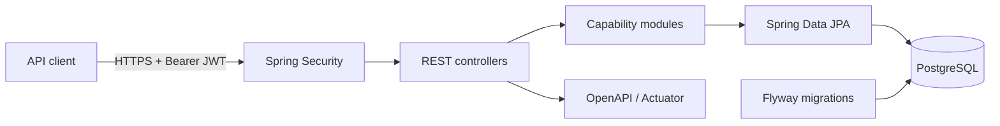
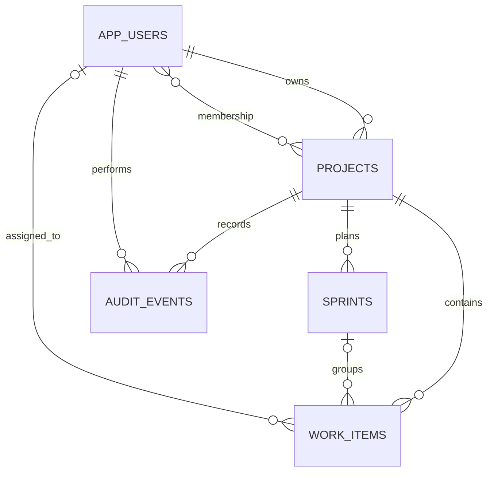

# SprintForge

   

SprintForge is a project-delivery REST API for teams that need a lightweight place to plan sprints, assign work, and track progress without losing change history. It models the authorization and consistency concerns that sit behind a collaborative board rather than treating the board as a collection of unrelated CRUD screens.

## Features

- Registration and login with BCrypt password hashing and time-limited JWTs
- Project ownership and member-based authorization
- Sprint planning with date validation and controlled status transitions
- Work-item assignment, priorities, deadlines, and guarded workflow transitions
- Search, status and priority filters, pagination, and sorting
- Per-project workflow summaries and append-only audit events
- Optimistic locking for concurrent project, sprint, and work-item updates
- PostgreSQL constraints, relationships, indexes, and versioned Flyway migrations
- Consistent validation and centralized JSON error responses
- Structured application logs, health probes, Actuator metrics, and Prometheus output
- OpenAPI documentation, Dockerized execution, and GitHub Actions verification

## Architecture

SprintForge is a modular monolith. Capability-based packages keep authentication, projects, sprints, tasks, audit history, and configuration separate while allowing state changes and audit records to share a database transaction.



```text
src/main/java/dev/sreedaya/sprintforge/
├── auth/        registration, login, token creation
├── user/        identities and credential persistence
├── project/     ownership, membership, access policies
├── sprint/      sprint lifecycle and metrics
├── task/        work-item workflow, queries, summaries
├── audit/       append-only project history
├── common/      shared HTTP error contract
└── config/      security, OpenAPI, and database wiring
```

The detailed [architecture document](docs/architecture.md) describes boundaries, security flow, transactional behavior, and design tradeoffs.

## Technology stack

| Layer | Technology |
| --- | --- |
| Runtime | Java 21, Spring Boot 4 |
| API | Spring MVC, Bean Validation, springdoc-openapi |
| Security | Spring Security, OAuth2 Resource Server, HS256 JWT, BCrypt |
| Persistence | Spring Data JPA, Hibernate, PostgreSQL 17, Flyway |
| Reliability | SLF4J, centralized exception handling, optimistic locking |
| Operations | Actuator, Micrometer, Prometheus, Docker |
| Verification | JUnit 5, MockMvc, Mockito, H2 test database, Maven |
| Automation | GitHub Actions, Render Blueprint |

## Database schema



Flyway migrations are in [`src/main/resources/db/migration`](src/main/resources/db/migration). Foreign keys enforce ownership and project boundaries; unique constraints prevent duplicate memberships, project keys, and sprint names. Composite indexes support board filters, sprint queries, assignee lookups, and reverse-chronological audit access.

## API

| Method | Endpoint | Access | Purpose |
| --- | --- | --- | --- |
| `POST` | `/api/v1/auth/register` | Public | Register and receive a JWT |
| `POST` | `/api/v1/auth/login` | Public | Authenticate and receive a JWT |
| `POST` | `/api/v1/projects` | Authenticated | Create a project |
| `GET` | `/api/v1/projects` | Authenticated | List accessible projects |
| `GET` | `/api/v1/projects/{id}` | Member | Read project details |
| `POST` | `/api/v1/projects/{id}/members/{email}` | Owner | Add a registered member |
| `PATCH` | `/api/v1/projects/{id}/archive` | Owner | Archive a project |
| `POST` | `/api/v1/projects/{id}/sprints` | Member | Create a sprint |
| `GET` | `/api/v1/projects/{id}/sprints` | Member | List project sprints |
| `PATCH` | `/api/v1/projects/{id}/sprints/{sprintId}/status` | Member | Advance or cancel a sprint |
| `POST` | `/api/v1/projects/{id}/work-items` | Member | Create and optionally assign work |
| `GET` | `/api/v1/projects/{id}/work-items` | Member | Search and page through work |
| `PUT` | `/api/v1/projects/{id}/work-items/{workItemId}` | Member | Update a work item |
| `DELETE` | `/api/v1/projects/{id}/work-items/{workItemId}` | Member | Delete a work item |
| `GET` | `/api/v1/projects/{id}/work-items/summary` | Member | Count work by status |
| `GET` | `/api/v1/projects/{id}/audit-events` | Member | Read project audit history |
| `GET` | `/actuator/health` | Public | Liveness and readiness status |

Swagger UI is available at `/docs`; the OpenAPI document is served at `/v3/api-docs`. List endpoints accept Spring pagination parameters such as `page`, `size`, and `sort`. Work-item queries also accept `status`, `priority`, and `q`.

## Run with Docker

Requirements: Docker Engine with Compose.

```bash
git clone https://github.com/Goureesankarr/sprintforge.git
cd sprintforge
docker compose up --build
```

PostgreSQL is checked for readiness before the API starts. Flyway applies both migrations during startup, and Hibernate validates the resulting schema.

Local URLs:

- Swagger UI: `http://localhost:8080/docs`
- OpenAPI: `http://localhost:8080/v3/api-docs`
- Health: `http://localhost:8080/actuator/health`
- Prometheus metrics: `http://localhost:8080/actuator/prometheus` (Bearer JWT required)

## Run with Maven

Java 21 and PostgreSQL 17 are required.

```bash
cp .env.example .env
docker compose up -d postgres
set -a && source .env && set +a
./mvnw spring-boot:run
```

## Environment variables

| Variable | Required in production | Description |
| --- | --- | --- |
| `DATABASE_URL` | Yes | PostgreSQL JDBC URL; platform-style `postgresql://` URLs are normalized |
| `DATABASE_USERNAME` | Yes | Database user |
| `DATABASE_PASSWORD` | Yes | Database password |
| `JWT_SECRET` | Yes | Random signing secret of at least 32 characters |
| `PORT` | No | HTTP port, defaults to `8080` |

Development defaults exist only to make local startup predictable. Never reuse them in an internet-facing environment.

## Example workflow

```bash
TOKEN=$(curl -s http://localhost:8080/api/v1/auth/register \
  -H 'Content-Type: application/json' \
  -d '{"email":"alex@example.org","password":"StrongPass123!","displayName":"Alex Morgan"}' \
  | jq -r '.token')

curl -s http://localhost:8080/api/v1/projects \
  -H "Authorization: Bearer $TOKEN" \
  -H 'Content-Type: application/json' \
  -d '{"name":"Market Data Platform","key":"MDP","description":"Delivery plan"}'
```

## Testing

```bash
./mvnw clean verify
```

The suite contains unit tests for access rules and workflow transitions plus integration tests that exercise registration, JWT-protected routes, validation failures, project creation, sprint planning, task assignment, filtering, summaries, audit history, and cross-user authorization. GitHub Actions runs the complete Maven verification lifecycle and builds the production Docker image on every change to `main` and on pull requests.

## Deployment

[`render.yaml`](render.yaml) defines a Docker web service, a PostgreSQL 17 database, generated JWT secret, health check, and deploy-after-CI policy. A public instance has not been provisioned yet, so the repository does not claim a live endpoint.

## Screenshots

Runtime screenshots will be captured from the public environment after its first successful deployment. Until then, the CI badge above and the reproducible Docker workflow are the verifiable execution evidence.

## Design decisions

- A modular monolith keeps cross-entity writes transactional without introducing distributed-system overhead.
- Project-scoped resources return `404` to non-members to avoid leaking valid identifiers; known members receive `403` for owner-only actions.
- Workflow transitions live in domain services instead of controllers, making the rules independently testable.
- Audit events commit in the same transaction as state changes. An outbox is the intended evolution if external event delivery is introduced.
- Symmetric JWT signing is appropriate for one service; an external identity provider and asymmetric key rotation are the next step for a multi-service environment.

## Future improvements

- PostgreSQL Testcontainers tests in addition to fast H2 integration tests
- Refresh-token rotation, email verification, and account recovery
- Project-specific roles beyond owner and member
- Comments, attachments, and work-item history views
- Correlation IDs, rate limiting, dashboards, and alert rules
- Transactional outbox for downstream notifications

## License

Licensed under the [MIT License](LICENSE).
