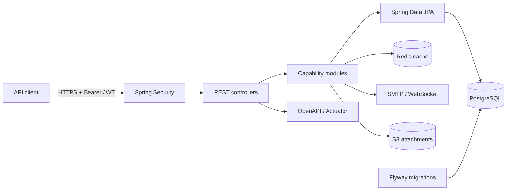
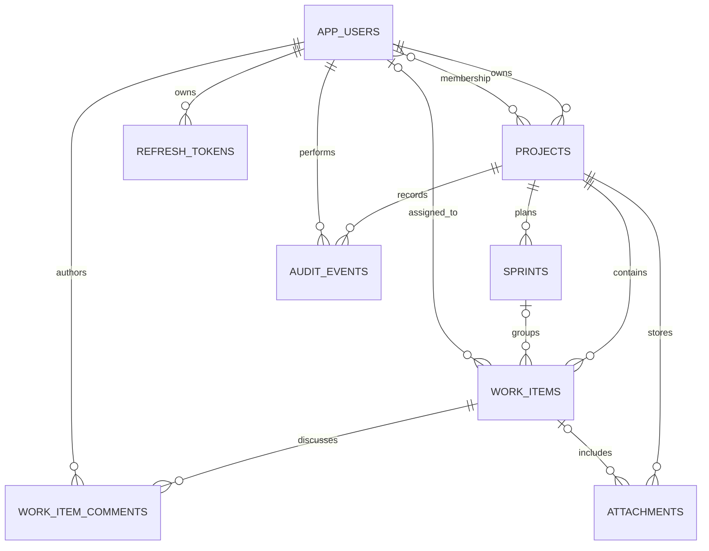
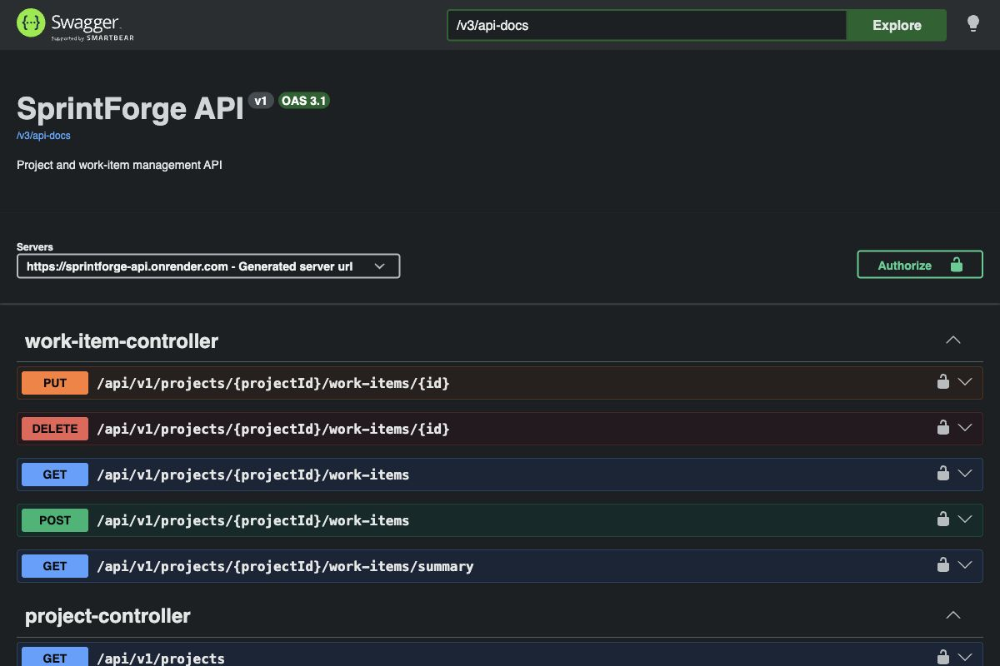
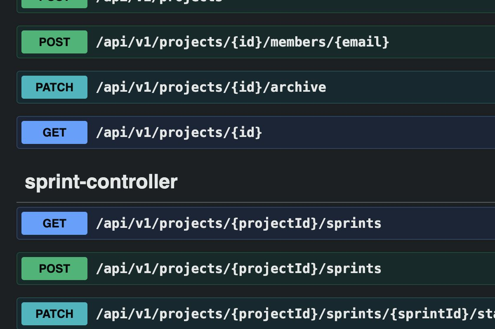

# SprintForge

    [](https://sprintforge-api.onrender.com/actuator/health)

SprintForge is a project-delivery REST API for teams that need a lightweight place to plan sprints, assign work, and track progress without losing change history. It models the authorization and consistency concerns that sit behind a collaborative board rather than treating the board as a collection of unrelated CRUD screens.

## Features

- Registration and login with BCrypt, short-lived JWTs, and hashed refresh-token rotation
- Hierarchical `ADMIN > MANAGER > USER` roles plus project ownership and membership policies
- Sprint planning with date validation and controlled status transitions
- Work-item assignment, priorities, deadlines, and guarded workflow transitions
- Paginated work-item discussions with author editing and owner moderation
- Search, status and priority filters, pagination, and sorting
- Redis-cached board summaries, soft-deleted work items, and append-only audit events
- Asynchronous email invitations and authenticated STOMP/WebSocket project updates
- S3 presigned attachment uploads with file type and 25 MiB size enforcement
- Optimistic locking for concurrent project, sprint, and work-item updates
- PostgreSQL constraints, relationships, indexes, and versioned Flyway migrations
- Consistent validation and centralized JSON error responses
- Structured logs, health probes, protected Prometheus metrics, and a provisioned Grafana dashboard
- OpenAPI, Docker, Testcontainers, JaCoCo, SpotBugs, OWASP Dependency-Check, SonarCloud, Trivy, and release automation

## Architecture

SprintForge is a modular monolith. Capability-based packages keep authentication, projects, sprints, tasks, audit history, and configuration separate while allowing state changes and audit records to share a database transaction.



```text
src/main/java/dev/sreedaya/sprintforge/
├── auth/        registration, login, access and refresh tokens
├── attachment/  S3 presigned upload lifecycle
├── comment/     work-item discussions and moderation
├── notification asynchronous email delivery
├── realtime/    project-scoped WebSocket events
├── user/        identities and credential persistence
├── project/     ownership, membership, access policies
├── sprint/      sprint lifecycle and metrics
├── task/        work-item workflow, queries, summaries
├── audit/       append-only project history
├── common/      shared HTTP error contract
└── config/      security, OpenAPI, and database wiring
```

The detailed [architecture document](docs/architecture.md) describes boundaries, security flow, transactional behavior, and design tradeoffs.

## Technology stack

| Layer | Technology |
| --- | --- |
| Runtime | Java 21, Spring Boot 4 |
| API | Spring MVC, Bean Validation, springdoc-openapi |
| Security | Spring Security, role hierarchy, HS256 JWT, refresh rotation, BCrypt |
| Persistence | Spring Data JPA, Hibernate, PostgreSQL 17, Flyway |
| Reliability | Redis, SLF4J, centralized errors, soft deletion, optimistic locking |
| Integrations | SMTP notifications, STOMP/WebSocket, AWS S3 presigned uploads |
| Operations | Actuator, Micrometer, Prometheus, Grafana, Docker Compose |
| Verification | JUnit 5, MockMvc, Mockito, H2, PostgreSQL Testcontainers, JaCoCo |
| Automation | GitHub Actions, SpotBugs, OWASP, SonarCloud, Trivy, Dependabot, Render |

## Database schema



Flyway migrations are in [`src/main/resources/db/migration`](src/main/resources/db/migration). Foreign keys enforce ownership and project boundaries; unique constraints prevent duplicate memberships, project keys, and sprint names. Composite and partial indexes support board filters, sprint queries, assignee lookups, active comment timelines, and reverse-chronological audit access.

## API

| Method | Endpoint | Access | Purpose |
| --- | --- | --- | --- |
| `POST` | `/api/v1/auth/register` | Public | Register and receive a JWT |
| `POST` | `/api/v1/auth/login` | Public | Authenticate and receive a JWT |
| `POST` | `/api/v1/auth/refresh` | Public | Rotate a refresh token and issue a new token pair |
| `POST` | `/api/v1/auth/logout` | Public | Revoke a refresh token |
| `PATCH` | `/api/v1/admin/users/{id}/role` | Admin | Change a user's global role |
| `POST` | `/api/v1/projects` | Authenticated | Create a project |
| `GET` | `/api/v1/projects` | Authenticated | List accessible projects |
| `GET` | `/api/v1/projects/{id}` | Member | Read project details |
| `POST` | `/api/v1/projects/{id}/members/{email}` | Owner | Add a registered member |
| `PATCH` | `/api/v1/projects/{id}/archive` | Owner | Archive a project |
| `POST` | `/api/v1/projects/{id}/sprints` | Member | Create a sprint |
| `GET` | `/api/v1/projects/{id}/sprints` | Member | List project sprints |
| `PATCH` | `/api/v1/projects/{id}/sprints/{sprintId}/status` | Member | Advance or cancel a sprint |
| `POST` | `/api/v1/projects/{id}/work-items` | Member | Create and optionally assign work |
| `GET` | `/api/v1/projects/{id}/work-items` | Member | Search and page through work |
| `PUT` | `/api/v1/projects/{id}/work-items/{workItemId}` | Member | Update a work item |
| `DELETE` | `/api/v1/projects/{id}/work-items/{workItemId}` | Member | Soft-delete a work item |
| `GET` | `/api/v1/projects/{id}/work-items/summary` | Member | Count work by status |
| `POST` | `/api/v1/projects/{id}/work-items/{workItemId}/comments` | Member | Add a discussion comment |
| `GET` | `/api/v1/projects/{id}/work-items/{workItemId}/comments` | Member | Read the paginated discussion |
| `PATCH` | `/api/v1/projects/{id}/work-items/{workItemId}/comments/{commentId}` | Author | Edit a comment |
| `DELETE` | `/api/v1/projects/{id}/work-items/{workItemId}/comments/{commentId}` | Author or owner | Soft-delete a comment |
| `GET` | `/api/v1/projects/{id}/audit-events` | Member | Read project audit history |
| `POST` | `/api/v1/projects/{id}/attachments/upload-url` | Member | Create an S3 upload ticket |
| `PATCH` | `/api/v1/projects/{id}/attachments/{attachmentId}/complete` | Member | Mark an upload available |
| `GET` | `/api/v1/projects/{id}/attachments` | Member | Page through attachment metadata |
| `GET` | `/actuator/health` | Public | Liveness and readiness status |

Swagger UI is available at `/docs`; the OpenAPI document is served at `/v3/api-docs`. List endpoints accept Spring pagination parameters such as `page`, `size`, and `sort`. Work-item queries also accept `status`, `priority`, and `q`.

## Run with Docker

Requirements: Docker Engine with Compose.

```bash
git clone https://github.com/Goureesankarr/sprintforge.git
cd sprintforge
docker compose up --build
```

PostgreSQL and Redis are checked for readiness before the API starts. Flyway applies migrations during startup, and Hibernate validates the resulting schema. Prometheus and Grafana are provisioned automatically.

Local URLs:

- Swagger UI: `http://localhost:8080/docs`
- OpenAPI: `http://localhost:8080/v3/api-docs`
- Health: `http://localhost:8080/actuator/health`
- Prometheus: `http://localhost:9090`
- Grafana: `http://localhost:3000` (`admin` / `sprintforge`, local use only)
- WebSocket/STOMP handshake: `ws://localhost:8080/ws` with an `Authorization` native header

## Run with Maven

Java 21 and PostgreSQL 17 are required.

```bash
cp .env.example .env
docker compose up -d postgres
set -a && source .env && set +a
./mvnw spring-boot:run
```

## Environment variables

| Variable | Required in production | Description |
| --- | --- | --- |
| `DATABASE_URL` | Yes | PostgreSQL JDBC URL; platform-style `postgresql://` URLs are normalized |
| `DATABASE_USERNAME` | Yes | Database user |
| `DATABASE_PASSWORD` | Yes | Database password |
| `JWT_SECRET` | Yes | Random signing secret of at least 32 characters |
| `REFRESH_TOKEN_TTL` | No | Refresh lifetime as an ISO-8601 duration, defaults to 30 days |
| `METRICS_KEY` | Yes | Key supplied to the protected Prometheus endpoint |
| `CACHE_TYPE` | No | Use `redis` with `SPRING_DATA_REDIS_HOST`, otherwise `simple` |
| `EMAIL_NOTIFICATIONS_ENABLED` | No | Enables SMTP invitations when mail settings are present |
| `S3_ENABLED` | No | Enables presigned uploads; requires bucket, region, and AWS credentials |
| `PORT` | No | HTTP port, defaults to `8080` |

Development defaults exist only to make local startup predictable. Never reuse them in an internet-facing environment.

## Example workflow

```bash
TOKEN=$(curl -s http://localhost:8080/api/v1/auth/register \
  -H 'Content-Type: application/json' \
  -d '{"email":"alex@example.org","password":"StrongPass123!","displayName":"Alex Morgan"}' \
  | jq -r '.token')

curl -s http://localhost:8080/api/v1/projects \
  -H "Authorization: Bearer $TOKEN" \
  -H 'Content-Type: application/json' \
  -d '{"name":"Market Data Platform","key":"MDP","description":"Delivery plan"}'
```

## Testing

```bash
./mvnw clean verify
```

The suite combines fast H2 tests with a Docker-aware PostgreSQL Testcontainers migration test. It covers access rules, workflows, token rotation, protected routes, validation, project and sprint flows, assignment, filtering, cached summaries, audited work-item discussions, owner moderation, and cross-user authorization. `verify` also writes the JaCoCo HTML/XML report under `target/site/jacoco`.

CI runs the tests and SpotBugs, builds the production image, and blocks high or critical Trivy findings. Separate workflows run OWASP Dependency-Check, opt into SonarCloud when repository credentials are configured, open Dependabot updates, and create GitHub Releases from `v*` tags.

## Deployment

The production API runs on Render with a managed PostgreSQL 17 database:

- API: [https://sprintforge-api.onrender.com](https://sprintforge-api.onrender.com)
- Swagger UI: [https://sprintforge-api.onrender.com/docs](https://sprintforge-api.onrender.com/docs)
- Health: [https://sprintforge-api.onrender.com/actuator/health](https://sprintforge-api.onrender.com/actuator/health)

[`render.yaml`](render.yaml) defines the Docker web service, PostgreSQL database, generated JWT secret, health check, and deploy-after-CI policy. The free web instance spins down when idle, so its first request after inactivity can take about a minute.

## Screenshots

### Live OpenAPI documentation



### Project and sprint endpoints



## Design decisions

- A modular monolith keeps cross-entity writes transactional without introducing distributed-system overhead.
- Project-scoped resources return `404` to non-members to avoid leaking valid identifiers; known members receive `403` for owner-only actions.
- Workflow transitions live in domain services instead of controllers, making the rules independently testable.
- Refresh tokens are random opaque values; only SHA-256 digests are stored, and rotation revokes each used token under a database lock.
- S3 uploads go directly from the client to object storage through short-lived presigned URLs, keeping file bytes outside the API process.
- Email and WebSocket delivery are secondary effects; database state remains authoritative if an external delivery channel is unavailable.
- Symmetric JWT signing is appropriate for one service; an external identity provider and asymmetric key rotation are the next step for a multi-service environment.

## Future improvements

- Transactional outbox and retry workers for guaranteed notifications
- S3 completion verification, malware scanning, and attachment retention policies
- Per-project roles in addition to the global role hierarchy
- Email verification, account recovery, comment mentions, and work-item history views
- Correlation IDs, rate limiting, alert rules, and distributed tracing

## License

Licensed under the [MIT License](LICENSE).
