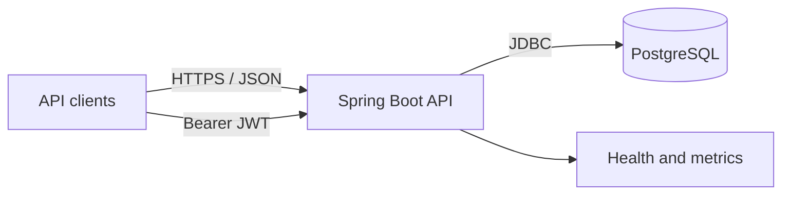
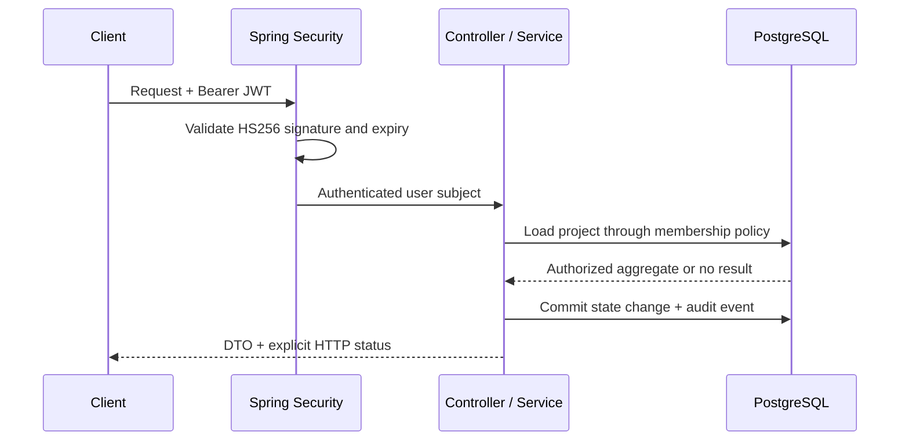
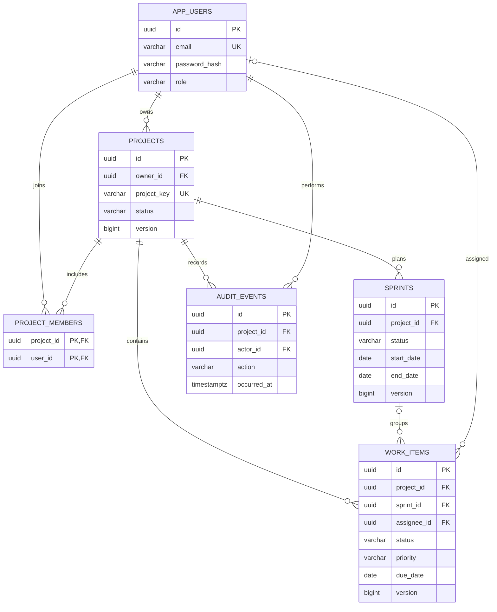

# Architecture

## System context

SprintForge is a stateless HTTP service used by browser, mobile, or command-line clients. It owns credentials, projects, memberships, sprints, work items, and audit history. PostgreSQL is its only required backing service.



## Module boundaries

| Module | Responsibility | Owns |
| --- | --- | --- |
| `auth` | Registration, credential verification, JWT issuance | Authentication endpoints |
| `user` | User identity and credential persistence | `app_users` |
| `project` | Project lifecycle, ownership, membership, access policy | `projects`, `project_members` |
| `sprint` | Sprint planning, lifecycle rules, operational counters | `sprints` |
| `task` | Assignment, guarded workflow, search, pagination, summaries | `work_items` |
| `audit` | Append-only records of significant state changes | `audit_events` |
| `config` | Security, OpenAPI, and datasource wiring | Application configuration |
| `common` | Consistent HTTP error responses | Shared error contract |

All modules run in one process and database. Capability boundaries keep dependencies visible and allow a module to be extracted later if scale or team ownership requires it.

## Request and security flow



Registration stores only a BCrypt hash. Login verifies the submitted password and returns a time-limited JWT. Spring Security authenticates every protected route before the controller runs. `ProjectAccessService` then applies resource-level owner/member rules.

Project-scoped endpoints intentionally return `404 Not Found` when the caller is not a member, preventing identifier discovery. An existing member receives `403 Forbidden` when attempting an owner-only operation such as adding members or archiving the project.

## Data model



- Application-generated UUIDs give entities stable identifiers before persistence.
- Foreign keys enforce ownership and project boundaries.
- Composite membership keys prevent duplicate memberships.
- Sprint dates have a database check constraint in addition to API validation.
- Indexes cover work-item status, assignee, sprint status, and audit timeline queries.
- `@Version` columns on projects, sprints, and work items detect conflicting writes.

## Lifecycle rules

Work items follow explicit transitions:

```text
BACKLOG -> TODO -> IN_PROGRESS -> IN_REVIEW -> DONE
             ^          │             │         │
             └──────────┘             └─────────┘
```

The service also permits moving `TODO` back to `BACKLOG`. These rules are isolated in `WorkItemWorkflow` and unit tested. Sprints move from `PLANNED` to `ACTIVE`, then to `COMPLETED`; planned or active sprints may be cancelled. Invalid transitions return `409 Conflict`.

## Transactions and consistency

Mutating endpoints run inside database transactions. A domain change and its audit event commit or roll back together. Flyway owns schema evolution; Hibernate uses `validate` at startup and never creates or updates production tables. Assignment is accepted only when the assignee is already a project member, and a work item can reference only a sprint from the same project.

## Error contract

`ApiExceptionHandler` converts validation and domain failures into a stable JSON shape containing timestamp, status, error, message, path, and field errors where relevant. The API uses `400` for malformed input, `401` for authentication failures, `403` for known-but-forbidden actions, `404` for absent or intentionally hidden resources, and `409` for uniqueness and lifecycle conflicts.

## Operational model

- `/actuator/health` supports container and platform health checks.
- `/actuator/metrics` exposes JVM, HTTP, datasource, and custom application meters.
- `/actuator/prometheus` supplies scrape-ready monitoring data.
- Sprint creation and status changes increment domain counters.
- Structured SLF4J events record significant actions using entity IDs rather than credentials or tokens.
- The application is stateless and can be replicated behind a load balancer.
- Runtime secrets and database credentials are injected through environment variables.
- Docker Compose provides a reproducible local environment; CI verifies tests before building the production image.

## Design decisions and tradeoffs

### Modular monolith

A single deployable avoids distributed transactions and operational overhead at the current scale. Capability packages retain a clear path to service extraction.

### Symmetric JWT signing

HS256 keeps local and single-service deployment simple. A multi-service system should delegate identity to an OpenID Connect provider and use asymmetric keys with rotation.

### Repository-backed resource authorization

Authorization is resolved against relational ownership and membership data before project-scoped resources are returned. This limits accidental data exposure at the cost of coupling the current policy to the database model.

### Synchronous audit writes

Audit records share the state-change transaction and therefore cannot be silently lost after a successful response. If events need external consumers, a transactional outbox can preserve that guarantee while moving delivery off the request path.

### Fast integration database

Integration tests use H2 in PostgreSQL compatibility mode for quick CI feedback. Flyway migrations and production execution target PostgreSQL 17. Testcontainers against real PostgreSQL is deliberately listed as future work rather than claimed as current coverage.
